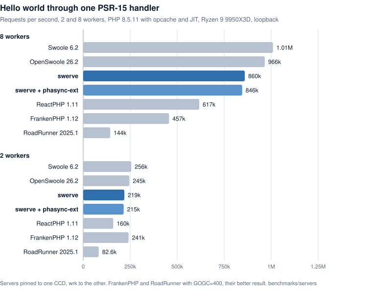
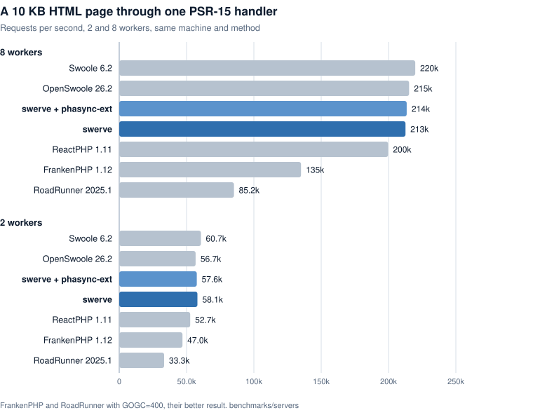
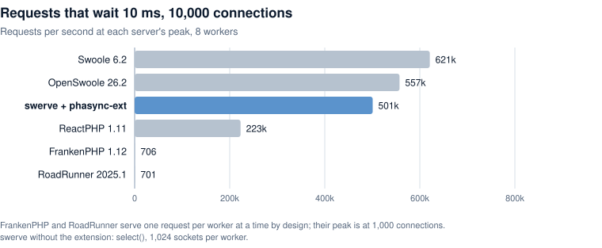
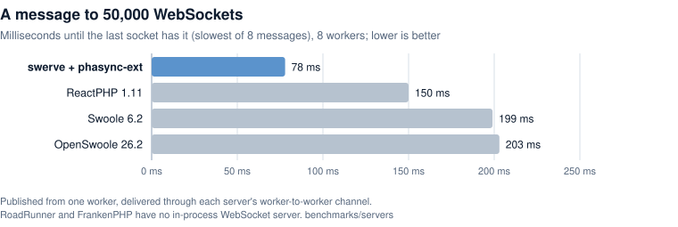
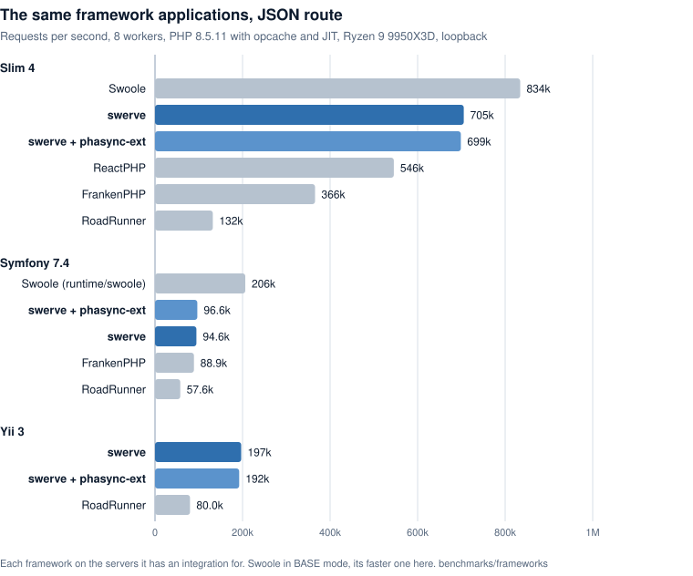
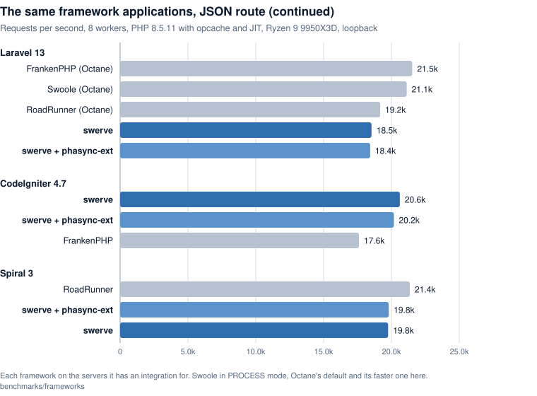

# Swerve


**A PHP application server for connections that stay open.**

```php
<?php // swerve.php

return new Swerve\RequestHandler(function (Swerve\ClientRequest $request) {
    $request->sendResponseHeaders(200, ['content-type' => 'text/plain']);
    $request->write("Hello, World\n");
});
```

Swerve is a PHP application server, built on [phasync](https://github.com/phasync/phasync)
coroutines. Your application stays loaded between requests, every worker serves many requests
and connections at once, and request and response bodies stream. A handler gets a
`ClientRequest`: the request to read and the response to write, for as long as it keeps it.
Frameworks are served through an adapter that turns a `ClientRequest` into the framework's own
request and response: [Laravel](https://github.com/phasync/swerve-laravel),
[Symfony](https://github.com/phasync/swerve-symfony), [Yii](https://github.com/phasync/swerve-yii),
[CakePHP](https://github.com/phasync/swerve-cakephp),
[Spiral](https://github.com/phasync/swerve-spiral),
[CodeIgniter](https://github.com/phasync/swerve-codeigniter) and
[Laminas](https://github.com/phasync/swerve-laminas).

> Beta: APIs and options may still change until 1.0.

**[Documentation](docs/README.md)** · [Examples](examples/): a chat room over
[Server-Sent Events](examples/sse-chat).

## Why swerve

PHP-FPM builds your application from nothing for every request (autoloader, framework,
container, database connection), runs one request per process, and throws it all away. swerve
keeps the application loaded in long-running workers, and each worker serves thousands of
requests and connections at once on [phasync](https://github.com/phasync/phasync) coroutines.

- **Connections that stay open.** Server-Sent Events and long polling from an ordinary request
  handler, streaming request and response bodies, raw connections after a `101`, and
  [publish/subscribe](docs/publish-subscribe.md) between workers, so live features need no
  separate Node or Go service.
- **Boot once, serve forever.** The framework, routes and connection pools are built once per
  worker. A Slim app costs swerve about 10% over a bare handler; Express costs Node half or more.
- **Waiting is free.** While one request waits for the database or an API, the same worker serves
  others. Your handler stays ordinary sequential PHP: no promises, no callbacks.
- **Isolated requests.** Each request runs in a phasync context of its own, which the coroutines it
  starts share, so request-scoped state stays separate even with thousands in flight.
- **Supervised.** Crashed workers restart, a worker stuck in a loop is replaced (the watchdog),
  workers that grow are recycled, and reloads roll one worker at a time.
- **Yours to own.** MIT, with no third-party dependencies beyond phasync and the PSR logger and
  cache interfaces. See [the Ennerd philosophy](PHILOSOPHY.md).

The same application on every server, 2 and 8 workers on one CCD of a Ryzen 9 9950X3D, wrk on
the other, over loopback ([method, scripts and raw results](benchmarks/servers/SUMMARY.md)).
8 workers serve 3.9× what 2 do.

<picture>
  <source media="(prefers-color-scheme: dark)" srcset="benchmarks/charts/hello-dark.svg">
  
</picture>

<picture>
  <source media="(prefers-color-scheme: dark)" srcset="benchmarks/charts/page-dark.svg">
  
</picture>

<picture>
  <source media="(prefers-color-scheme: dark)" srcset="benchmarks/charts/wait-dark.svg">
  
</picture>

<picture>
  <source media="(prefers-color-scheme: dark)" srcset="benchmarks/charts/websocket-dark.svg">
  
</picture>

The same framework applications on each server they have an integration for
([method and results](benchmarks/frameworks/SUMMARY.md)). With phasync-ext, Symfony on swerve
also overlaps requests that wait: 10,455 req/s with a 10 ms wait at 8 workers, where one request
per worker at a time gives about 780.

<picture>
  <source media="(prefers-color-scheme: dark)" srcset="benchmarks/charts/frameworks-lean-dark.svg">
  
</picture>

<picture>
  <source media="(prefers-color-scheme: dark)" srcset="benchmarks/charts/frameworks-full-dark.svg">
  
</picture>

Up to 512 connections per worker swerve runs on PHP's own `stream_select()`; above that
it needs phasync-ext, which waits with epoll.


### Coming from PHP-FPM

1. **Already using phasync under FPM?** That code runs unchanged in swerve: the coroutines you
   started inside one request now also share the worker with other requests.
2. **Keep per-request state per request.** A worker runs many requests at once, so static
   properties and globals are shared between them. There are no `$_GET`, `$_SERVER` or
   `$_SESSION`: read request data from the `ClientRequest` (a framework's adapter does), and hang
   request-scoped state on `phasync::getContext()`. See
   [How swerve runs your application](docs/how-it-runs.md).
3. **Return a `Swerve\RequestHandler`** from `swerve.php`. A framework gets an adapter that turns
   the `ClientRequest` into its own request and response.
4. **Load phasync-ext** in production (it ships inside phasync: `--ext`, or `"extra": {"phasync": {"ext": true}}` in composer.json). Blocking calls in
   libraries you did not write (MySQL through PDO or mysqli, curl, Guzzle, file and DNS functions) then wait as a
   coroutine instead of stalling the worker, and a worker can hold far more than 1,024
   connections.

## Getting started

Requirements: PHP 8.2 or later on Linux, with the `pcntl`, `posix` and `sockets` extensions.

1. Install swerve. While it is beta, your project must allow beta packages:

   ```bash
   composer config minimum-stability beta
   composer config prefer-stable true
   composer require phasync/swerve
   ```

2. Create `swerve.php` in your project root, returning a `Swerve\RequestHandler` that wraps a
   closure (the file is also your [bootstrap](docs/bootstrap.md): each worker runs it once at
   start). The closure runs once for each HTTP exchange, and the exchange lasts as long as the
   closure does:

   ```php
   <?php // swerve.php

   return new Swerve\RequestHandler(function (Swerve\ClientRequest $request) {
       $request->sendResponseHeaders(200, ['content-type' => 'text/plain']);
       $request->write("Hello, World\n");
   });
   ```

   Keeping the request open makes a stream. This one pushes a number every second as
   Server-Sent Events, until the client leaves:

   ```php
   <?php // swerve.php

   use phasync;
   use phasync\IOException;

   return new Swerve\RequestHandler(function (Swerve\ClientRequest $request) {
       $request->sendResponseHeaders(200, ['content-type' => 'text/event-stream', 'cache-control' => 'no-cache']);
       $request->flush(); // the head goes out now, not with the first event
       try {
           for ($n = 1; ; ++$n) {
               $request->write("data: $n\n\n");
               phasync::sleep(1);
           }
       } catch (IOException) {
           // the client left
       }
   });
   ```

3. Run it:

   ```
   > vendor/bin/swerve
   2026-09-26 17:00:30.12    swerve 0.1.0 serving ./swerve.php on http://127.0.0.1:8080 with 8 workers
   2026-09-26 17:00:31.25 3 GET / 200 1.2ms
   2026-09-26 17:00:31.31 6 GET /missing 404 0.4ms
   ```

   Each line has the time, the worker (its slot number, 0 to 7 here; blank for the master
   process), and the message: a request with its status and how long the application took,
   or anything else worth knowing, such as a worker that crashed and was restarted. Ctrl+C
   stops swerve, letting the requests in flight finish first.

   ```bash
   vendor/bin/swerve --watch              # during development: reload when a PHP file changes
   vendor/bin/swerve --public=public      # also serve the files in public/ (CSS, JavaScript, images)
   vendor/bin/swerve app.php --http :80   # app.php on port 80 of every interface
   ```

## Usage

```
> vendor/bin/swerve --help
Usage: swerve [options] [swerve.php]

Application:
  [swerve.php]                     A PHP file returning a Swerve\RequestHandler, which runs once per request with a ClientRequest
  --adapter=<name>                 The adapter that provides the entry point: an installed one by name, or swerve for swerve.php (see README, Adapters); without it, the application's composer.json, the only installed adapter, else swerve

Serving:
  --http=<address>                 Serve HTTP here: 8080 (this machine only), :8080 (every interface), host:port, [ipv6]:port or unix:/path; repeat for several (default: 127.0.0.1:8080)
  --public=<dir>                   HTTP: serve the files in this directory (CSS, JavaScript, images), and pass the rest to the application
  --trusted-proxy=<ip|range|unix>  HTTP: believe the X-Forwarded-For, -Proto and -Host of a proxy at this IP address, range (10.0.0.0/8) or unix (unix: sockets); repeat for several
  -w, --workers=<n>                Worker processes; auto is one per CPU core (default: auto)

Extension:
  --ext                            Load phasync-ext (bundled with phasync) even if composer.json does not enable it; swerve stops if it cannot

Development:
  --watch                          Reload the workers, one at a time, when a PHP file of the application changes

Logging (to the terminal, or with --log to a file):
  -v, --verbose                    Log more: -v also what swerve does (workers starting, draining), -vv also debug
  -q, --quiet                      Log nothing to the terminal (--log still logs to its file)
  --no-access-log                  No line per request
  --log=<path>                     Append the log, and PHP errors, to this file instead

Limits:
  --max-body=<bytes>               HTTP: the largest request body in bytes (413), 0 for no limit (default: 8388608)
  --grace=<seconds>                Seconds workers get to finish their requests on shutdown, reload and recycle before SIGKILL (default: 30)
  --linger=<seconds>               Seconds a recycled worker may keep serving its upgraded connections (101) after its replacement took over; 0 = not at all (default: 1800)
  --watchdog=<seconds>             Replace a worker whose event loop is stuck this long (CPU work that never yields counts); at least 1, 0 = off (default: 30)
  --max-memory=<size|P%>           Recycle a worker above this memory after gc: bytes, K, M or G, or a % of memory_limit; 0 = off (default: 80%)
  --max-requests=<n>               Recycle a worker after about n requests; 0 = off (default: 0)
  --cache-size=<size>              The most Swerve::cache() holds, shared by the workers in the master: bytes, K, M or G (default: 64M)

Information:
  -h, --help                       This help
  --version                        The versions of swerve, PHP, phasync and phasync-ext
```

Options and the application file may come in any order; an option's value is attached
(`--workers=4`, `-w4`) or the next word (`--workers 4`, `-w 4`). A usage error exits with
code 2, and so does an application (a `swerve.php` or an adapter's entry) that returns anything but a
`Swerve\RequestHandler`.

swerve runs in the foreground, as systemd, Docker and supervisord expect, and logs to
standard output, which they collect; there is no daemon mode. Elsewhere,
`nohup swerve -q --log=/var/log/swerve.log &` does the same.

Every worker serves HTTP/1.1 itself on the `--http` address, and the kernel spreads new
connections over the workers. A proxy in front (nginx, HAProxy, Caddy) speaks HTTP to it too.

The line per request costs about 5% of the throughput of a hello-world application, and
less of a real one; `--no-access-log` turns it off.

## Adapters

An adapter is an installed package that provides the entry point in place of `swerve.php`. It
declares itself in its own `composer.json`:

```json
{"extra": {"swerve": {"adapter": "psr15", "entry": "Swerve\\Psr15\\init"}}}
```

`entry` names a function that each worker calls once, after the fork and after `vendor/autoload.php`
is loaded, with the application directory; it returns a `Swerve\RequestHandler`, as `swerve.php`
does, and anything else stops swerve with exit code 2. The master only reads
`vendor/composer/installed.json` to find adapters, and loads none of their code.

The adapter is the first of: `--adapter=<name>`; `"extra": {"swerve": {"adapter": "<name>"}}` in the
application's own `composer.json`; the only installed adapter; `swerve`, the built-in one, which
loads `swerve.php` (always available as `--adapter=swerve`). Several installed adapters and no
choice, or a name that is not installed, stops swerve at start. With an adapter other than `swerve`,
a `swerve.php` in the application directory is ignored (logged once), and giving one on the command
line is an error. The application directory is the directory of that argument, else the current one.

## Static files

`--public=<dir>` serves the files in a directory, and passes every other request to the
application: `/css/site.css` is `public/css/site.css`, `/` is `public/index.html`. Files are
streamed, with their Content-Type, Content-Length, Last-Modified and ETag; a browser's
revalidation gets `304 Not Modified`, and a `Range` request (video, resumed downloads) `206
Partial Content`. Other methods than GET and HEAD, names starting with a dot (`.env`, `.git/`;
`.well-known/` is served), PHP files (`.php`, `.phtml`, `.phar`, `.inc`: a source is never sent),
and paths leading out of the directory (`..`, a symlink pointing outside) go to the application;
directories are never listed. This is deliberately small: for a lot of static content, or
anything beyond this, let nginx or a CDN serve it in front of swerve.

The same is available to your own handler: `(new Swerve\StaticFiles($dir))->wrap($handler)` returns
a handler that answers file requests and calls `$handler` for the rest.

## Logging from the application

`Swerve::log()` is swerve's log as a PSR-3 `LoggerInterface`: lines go where swerve's go (the
terminal, or `--log`'s file), with the time and the worker's slot. Give it to anything that takes
a logger, or log directly:

```php
Swerve::log()->warning('Payment {id} declined', ['id' => $id]);
```

With `-q` it logs nothing; embedded without swerve's command line, it logs nothing until you give
it a logger with `Swerve::setLog()`.

## The ClientRequest

`Swerve\ClientRequest` is one HTTP exchange, a `phasync\Net\Duplex`: `read()` returns the request
body (`''` only at its end) and `write()` sends the response body. The module does the framing.
[Requests and responses](docs/requests-and-responses.md) is the reference; in short:

- The handler runs in the connection's own coroutine, once per exchange, in a phasync context of its
  own (`phasync::finally()` in a handler runs once the exchange is finished). Return to finish the
  response; the request body can no longer be read after that.
- `sendResponseHeaders($status, $headers)` sets the head, held until the first `write()`, `end()`,
  `flush()` or `sendFile()`. A `1xx` goes out at once (`103` Early Hints, repeatable); a `101`
  switches to the raw connection.
- Nothing is buffered: `write()` goes straight out, chunked unless you send a `content-length`.
  `write()` throws `phasync\IOException` once the client is gone, which is how a producer learns
  it can stop.
- An exception before the head went out is a `500` (logged); after, the connection is aborted.
- The request body, query string and cookies are yours to parse from `read()`, `getTarget()` and
  `getRequestHeaders()`; there is no PSR-7 request.

## Long-lived connections

- **Shutdown and reload.** A request in flight is answered with `Connection: close`. A
  `Swerve::subscribe()` loop ends, so a response fed by one ends too, and the client reconnects to
  another worker. Another long response (long polling, a slow download) runs until the drain
  deadline, a second before `--grace`: check `Swerve::draining()` in its loop to end it sooner. After a
  `101`, the connection's `read()` returns `''`, as if the client had closed its side, however
  much more it sends: end your side then. Past the deadline the worker exits and drops the
  connection, which is logged.
- **Recycle: lingering.** A worker replaced by a recycle (`--max-memory`, `--max-requests`)
  keeps its upgraded connections instead of draining them: it stops accepting, finishes its
  plain requests and stays until the last client has left, or `--linger` seconds (1800) have
  passed, which then ends it like a drain. Subscriptions, the cache and claims keep working
  meanwhile. A slot has at most three lingering workers; a recycle that would make a fourth waits
  until one exits. A reload or shutdown ends the lingering with `--grace`. `--linger=0` drains a
  recycled worker at once.
- **Saying goodbye.** `Swerve::onShutdown($callback)` runs the callback in a coroutine when the
  worker closes its connections (for a recycle, at the end of the lingering; `Swerve::draining()`
  turns true when it begins), for example to send a protocol-level goodbye from a place that
  holds no request. Callbacks are held weakly by the registering coroutine's context: one
  whose request has ended is dropped (it relies on phasync's garbage collection, about half a
  second after a coroutine ends) and never runs. An exception in a callback is logged and
  stops no other. `Swerve::awaitShutdown($timeout)` waits for the same moment.
- **Many connections.** Without phasync-ext a worker serves at most 512 connections, whatever
  `ulimit -n` says: add workers or install the extension for many of them.
- **Server-Sent Events** are an ordinary streamed response; see [Realtime](docs/realtime.md).
  WebSockets will come as a library on the raw connection of a `101`.

## Publish and subscribe

A message published in any worker reaches the subscribers of its topic in every worker, the
publishing one included: a chat room, a live dashboard, cache invalidation.

```php
use Swerve\Swerve;

Swerve::publish('chat', $message);

foreach (Swerve::subscribe('chat') as $message) {
    // every message published to 'chat' from the moment subscribe() returned
}
```

- Messages travel as JSON, decoded once per worker and shared by its subscribers: a subscriber
  gets the value published (`Swerve::publish('game', ['kill', $id])` an array, `'{}'` a string,
  `['end' => true]` a read-only object: `$message->end`).
- The master keeps, per topic, which workers have subscribers; a publishing worker writes the
  message straight into their inboxes. One worker's messages arrive in the order it published
  them; there is no order between workers. Without the master (swerve embedded in your own
  process), they are delivered in that process.
- Delivery is at most once, to the subscriptions that exist when a message reaches their
  worker. There is no history: a worker started after a reload, a recycle or a crash sees
  nothing sent before it. Swerve is one machine; across machines, use Redis, NATS or the like.
- A subscription ends when its last reference goes: a `break`, the variable going out of scope,
  the request's coroutine ending. A topic costs nothing in a worker without subscribers.
- `new \Swerve\OrderedChannel('ledger')` is for many publishers that need one common order: its
  `write()` and `subscribe()` (or `foreach ($channel as $m)`) give every subscriber, in every
  worker, the same order, apart from the plain topic of that name.
  The workers append to a log file in the master's temporary directory, and a message that was
  appended survives the death of its worker. Files are kept for about 30 s, a subscriber further
  behind gets a `SubscriberLagException`, and nothing is written while nobody subscribes.
  `SWERVE_TMPDIR` names the directory the master makes its temporary directories in (default
  the system's temporary directory; tmpfs such as `/dev/shm` is fine). Nothing is synced or
  durable beyond the master.
- A message is kept once per worker, however many subscribe, until the slowest subscriber
  read it. One falling more than `maxLag` seconds behind (30 by default,
  `Swerve::subscribe('prices', maxLag: 5)`) gets a `SubscriberLagException` from its loop.
- Topics are 1 to 255 bytes, messages at most 128 KiB. A worker that does not read its
  inbox (its event loop stuck) loses the messages sent to it after 0.1 s, with a warning in the
  log; it does not hold up the publishers.

## Shared cache

`Swerve::cache()` is a PSR-16 cache every worker shares, held by the master: sessions, rate
limits, results that are costly to make.

```php
$cache = Swerve::cache();
$user  = $cache->get("user:$id") ?? load_user($id);
$cache->set("user:$id", $user, 60);
```

- Each worker keeps what it read in a local layer (8 MiB), so a repeated read costs about a
  microsecond. A write goes to the master, which tells every worker to forget those keys; a
  worker never keeps a value older than the last write it was told of. A trip to the master
  costs about 0.1 ms, and only the calling coroutine waits.
- The master evicts the least recently used entries past `--cache-size` (64 MiB). It keeps
  values serialized and never loads your classes. A rolling reload keeps the contents; a
  restart empties them.
- A coroutine that `swerve.php` starts may use it at once: the call waits until the worker serves. Directly in
  `swerve.php` it throws ([details](docs/bootstrap.md#what-works-where)). Without the master (swerve
  embedded in your own process), the cache is the process's own.

### Claims

`Swerve::claim($name)` gives a handle on a name that one worker at a time can hold: a job that
must not run twice, a leader. The handle claims nothing yet.

```php
function nightlyReport(): void
{
    if ($claim = Swerve::claim('nightly-report')->acquire()) {
        work();
    }
}   // $claim goes out of scope: released
```

- `available()` tells whether nobody holds the name, claiming nothing. `acquire($timeout)` takes
  it and returns the handle, or `null`; with a `$timeout` it tries again every 20 ms until the
  name is free (no queue: the first to try when it frees wins). On a handle that holds the name
  already, it returns the handle. `held()` tells whether this handle holds it. `release()` gives
  it up.
- A claim has no TTL: it is held until released, destroyed, or its worker exits or dies (the
  master clears a dead worker's claims). Draining does not release it: a long-lived holder
  should release it itself when `Swerve::draining()`, so that a reload is not held up. Names are
  apart from the cache's keys.
- A claim is a file in a temporary directory (under `$SWERVE_TMPDIR`) that the master creates and removes: a hard link
  to a file with its holder's pid in it. Linking is atomic, and fails while the name is held.
  Without the master it works the same, in a directory of the process that dies with it.

## Supervision

A master process starts the workers and looks after them. It never loads the application
itself: each worker loads it after starting, so a reload runs the current code.

| Signal to the master | Effect |
|---|---|
| `SIGTERM`, `SIGINT` (Ctrl+C), `SIGQUIT` | Graceful shutdown: the workers stop accepting, finish the requests in flight (answered with `Connection: close`), close idle keep-alive connections and exit. What is left after `--grace` seconds is killed. A second signal kills at once. |
| `SIGHUP`, `SIGUSR2` | Rolling reload: the workers are replaced one at a time. Each new worker listens before the old one drains, so there is always a listener. The `--log` file is reopened first, by the master and the workers, so `logrotate` can rename it and send `SIGHUP`. |
| `SIGUSR1` | Reopen the `--log` file only. |

`SIGQUIT`, `SIGUSR1` and `SIGUSR2` mean what they mean to php-fpm, so its deploy and
`logrotate` scripts work unchanged. The master asks a worker to drain over its pipe, not with a
signal, which would cut short a blocking call (`sleep()`, `stream_select()`) of a request in
flight.

Workers ignore `SIGINT` and `SIGHUP` sent to the whole process group (Ctrl+C, a closing
terminal): only the master decides. When the master itself dies, the workers drain and exit;
one stuck in a busy loop or a blocking call, which can't drain, kills itself a second after the
`--watchdog` timeout, so that it doesn't keep the port (with `--watchdog=0` it stays until it
gets unstuck); one still loading the application does the same a second after the 60 seconds
the master allows for that. A worker sent `SIGTERM` by someone else (an operator, the OOM
tooling) drains, and the master starts another in its slot. `SIGQUIT` to a worker logs what it
is doing: its requests in flight, and where its code runs.

- **Crashes.** Every worker exit is logged with its exit code or signal, and the worker is
  restarted. A worker that dies before it was ready, or within 5 seconds of it without having
  served a request, is a failed start: its slot waits 0.5, 1, 2, 4, ... up to 30 seconds before
  the next start, and three in a row are logged as a crash loop. A worker that served requests
  started fine: a request killed it, and it is restarted at once. When every slot failed to
  start before any worker became ready (the application can't load, the port is taken), swerve
  exits with the worker's exit code, or 1 when that is 0 (`die('no config')`). A new worker of a
  reload or a recycle that fails to start leaves the old one serving, and is retried in its
  slot with the same backoff, so a failure that passes (a database away for a moment) doesn't
  leave the old code serving for good. A PHP fatal error is logged by its worker, with the
  requests it had in flight. An exception in
  the application answers 500, is logged with its request, and the worker serves on; one in a
  background coroutine nobody awaits is logged too. The master also reaps children it did not
  start, as PID 1 in a container without `--init` or after `job & exec swerve` in an
  entrypoint.
- **Stuck workers.** Each worker's event loop sends the master a heartbeat four times a second.
  Requests starting and ending count too, so a worker busy with many short blocking requests in
  a row is not taken for stuck. A worker silent for `--watchdog` seconds, stuck in a busy loop or
  a blocking call, logs its requests in flight and where its code runs (`SIGQUIT`), and is
  killed and replaced. So is a request that does more CPU work than that without yielding; raise
  `--watchdog`, or set it to 0, for such applications. A worker uses `SIGALRM` to notice that
  the master died while it was stuck (see above), a second after the timeout, so that a live
  master kills it first and a shorter blocking call (`sleep()`, `stream_select()`) is never
  cut short; with `--watchdog=0` the application may use `SIGALRM` itself.
- **Memory leaks.** After each request, and every tick, a worker compares
  `memory_get_usage(true)` with `--max-memory` (by default 80 % of `memory_limit`, and off when
  `memory_limit` is -1 unless the option is given). Above it, after a garbage collection, the
  master starts a replacement and the leaking worker finishes its plain requests and lingers
  (see Recycle: lingering above), up to `--linger` seconds. `--max-requests` recycles after
  about so many requests. The limits get some jitter, so workers don't recycle together. A
  `--max-memory` not below `memory_limit` could never be reached first: it is logged as a
  warning, and recycling is off. A
  worker that hits `memory_limit` itself dies with PHP's fatal error (in the log with `--log`),
  loses its requests in flight, and is replaced.
- **`--watch`** watches the `*.php` files next to and below the swerve file (not in
  `vendor/`, nor names starting with a dot, such as editors' lock files; but
  `vendor/composer/installed.php`, so `composer install` counts) and reloads 1 to 2 seconds
  after the last change. Directories it can't read are skipped. The scan runs in the master:
  on a large tree (`node_modules`, caches) it waits ten times as long as the last scan took
  before the next, so that the master stays mostly idle, and changes take that much longer to
  be noticed.

What a reload picks up: the swerve file and every class autoloaded in the worker, with
Composer's class map and PSR-4 prefixes read again (`opcache_reset()` is called too). It does
not pick up swerve itself, phasync, Composer `files` autoloads, `php.ini` or the command line
options; restart for those. The swerve file's path is not resolved, so a deploy that points a
`current` symlink at a new release and sends `SIGHUP` runs the new release; but the class map
and PSR-4 prefixes read again are those of the `vendor/` directory the master loaded at its
start, so an application whose swerve file requires its own release's `vendor/autoload.php`
is safest.

Operating notes:

- Linux resets connections still waiting in the accept queue of a listener that closes. For
  handovers without any lost connection, set `sysctl net.ipv4.tcp_migrate_req=1` (swerve logs a
  hint at startup when it is 0).
- Give the process manager more time than `--grace`: `docker stop -t 35`, Compose
  `stop_grace_period: 35s` or systemd `TimeoutStopSec=35` for the default 30 seconds. During a
  handover a slot briefly has two workers, so budget for one worker's memory more.
- Long responses such as Server-Sent Events or long polling are cut at the end of the grace
  period, on a reload or shutdown; a recycled worker keeps them up to `--linger` seconds. A slot
  may then have up to three lingering workers beside the serving one: budget their memory too.
- Without `-v` the log has notices and up: reloads, recycles, every worker exit, the pid of
  each worker started after the first ones, and shutdown. `-v` adds the first starts and each
  worker's readiness, `-vv` debug lines. What a client sent, such as a request target in an
  error, is logged as it is, with control characters escaped.
- swerve refuses to start on an address something already listens on. Its own workers share
  the address with `SO_REUSEPORT`, which would otherwise let a second swerve (a forgotten one,
  or one started by hand next to systemd's) silently take a share of the connections.
- Log lines to a pipe that nobody reads (a stalled log collector) are dropped rather than
  block the server; with `--log` they go to a file, which never blocks. A line that can't be
  written (a full disk, a log reader gone) is dropped without a PHP warning, which an
  application's error handler could turn into an exception.
- A worker at its limit of connections (its open-file limit less 64, and without phasync-ext at most 512) logs a
  warning, at most once a minute.
- Options go before the swerve file: anything after it is refused.
- The listeners and the workers' pipes to the master are close-on-exec (this needs the
  `sockets` extension of PHP 8.4 or later), so a background job the application starts
  (`exec('job &')`, `proc_open()`, `mail()`) doesn't keep the port after its worker died or
  swerve stopped. A client connection is still inherited, and the job holds it open until it
  exits.
